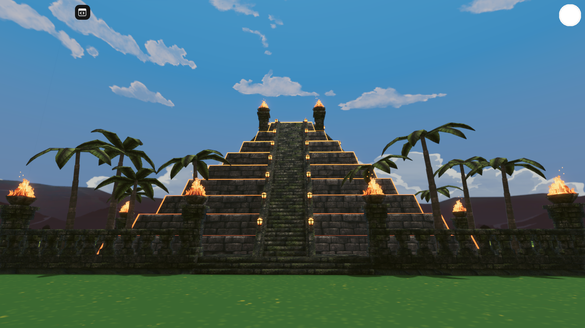
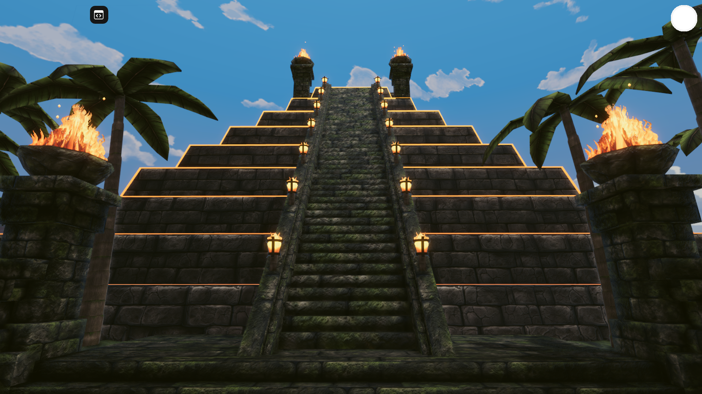
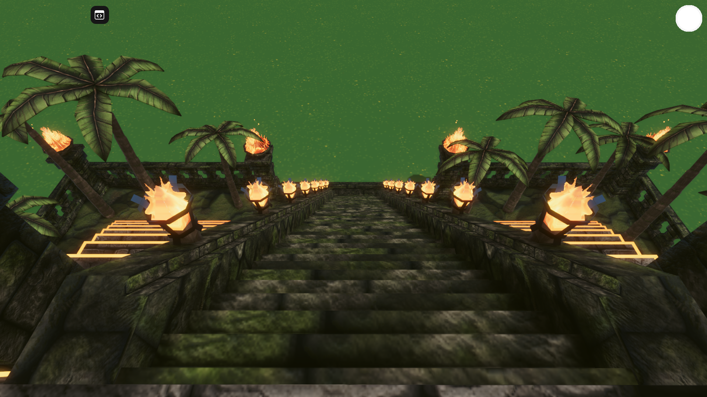
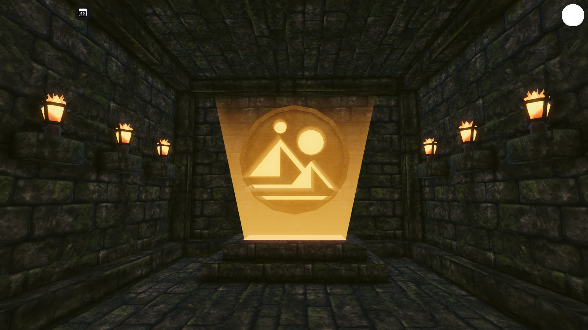
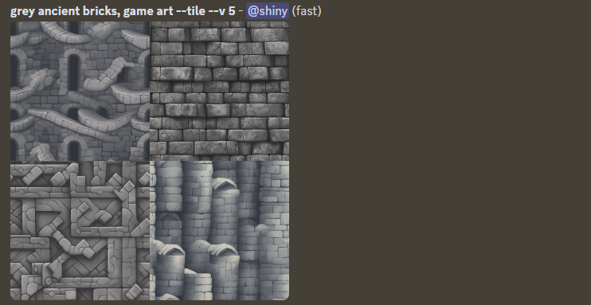
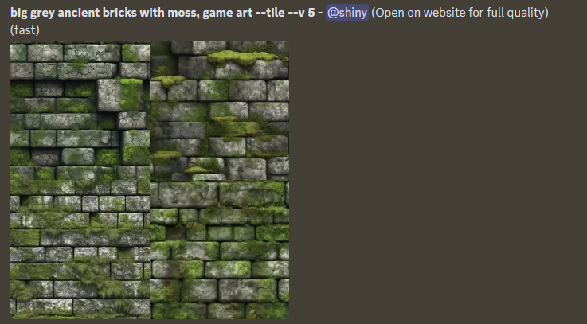
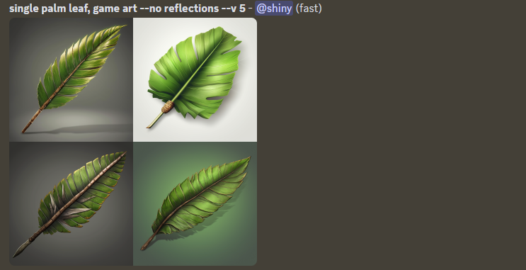

# Decentraland scene

This project contains Decentraland scene created for Sandstorm's Decentraland contest #20 - Hidden Treasures.
Currently deployed under Decentraland name `Positivity`. Follow [this link](https://play.decentraland.org/?realm=positivity.dcl.eth) or type in the Decentraland chatbox `/changerealm positivity.dcl.eth` to visit the scene.






## 3D models

Textures used for 3D models:

- Bark for palm trees [ambientCG](https://ambientcg.com/view?id=WoodSiding010), AmbientCG has a nice selection of textures under [Creative Commons CC0 1.0 Universal License](https://docs.ambientcg.com/books/website-licensing/page/license-information)
- Gold for hidden treasure [ambientCG](https://ambientcg.com/view?id=Metal007)
- Textures for bricks, ground, palm tree leafs and fire generated using Midjourney. For some of these images normal maps created using Gimp.
  - Bricks - top right image
    
  - Bricks with moss - bottom right image
    
  - Moss on the ground - bottom left image
    
  - Palm tree leafs - bottom right image
    
  - Fire - bottom right image
    

## Try it out

**Install the CLI**

Download and install the Decentraland CLI by running the following command:

```bash
npm i -g decentraland
```

**Previewing the scene**

Open this folder on the command line, then run:

```
dcl start
```

Any dependencies are installed and then the CLI opens the scene in a new browser tab.

## Deploy to Decentraland

If you own any parcels of land in Decentraland, or have permissions to deploy to someone else's, you can publish this project.

1. Make sure the scene parcels in `scene.json` match those you own or have permissions on.
2. Run `dcl deploy` on the project folder
3. This will open a browser tab to confirm. Metamask will prompt you to sign.
   > Note: Make sure you are using the wallet that owns the parcels or has permissions.

### Deploy to a free server

If you don't own parcels in Decentraland or are not ready to publish your scene to the world, you can share your creations by uploading your scenes to a free hosting service.

See [Upload a preview](https://docs.decentraland.org/development-guide/deploy-to-now/) for instructions on how to do this.

## Resources

Learn more about how to build your own scenes in our [documentation](https://docs.decentraland.org/) site.

Find more example scenes, tutorials and helper libraries in the [Awesome Repository](https://github.com/decentraland-scenes/Awesome-Repository).

If you need any help, join [Decentraland's Discord](https://dcl.gg/discord), where you'll find a vibrant community of other creators who are eager to help. You're sure to find help in the #SDK support channel.

## Copyright info

This scene is protected with a standard Apache 2 licence. See the terms and conditions in the [LICENSE](/LICENSE) file.
