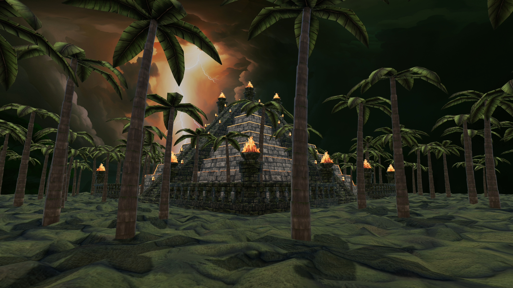
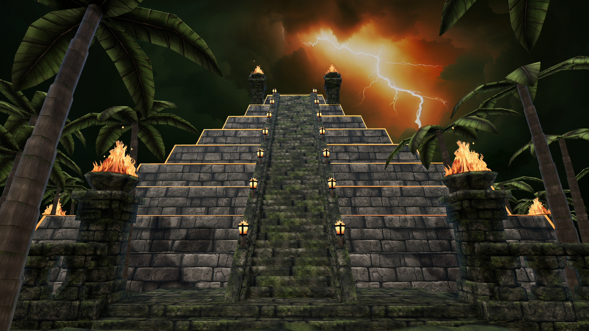
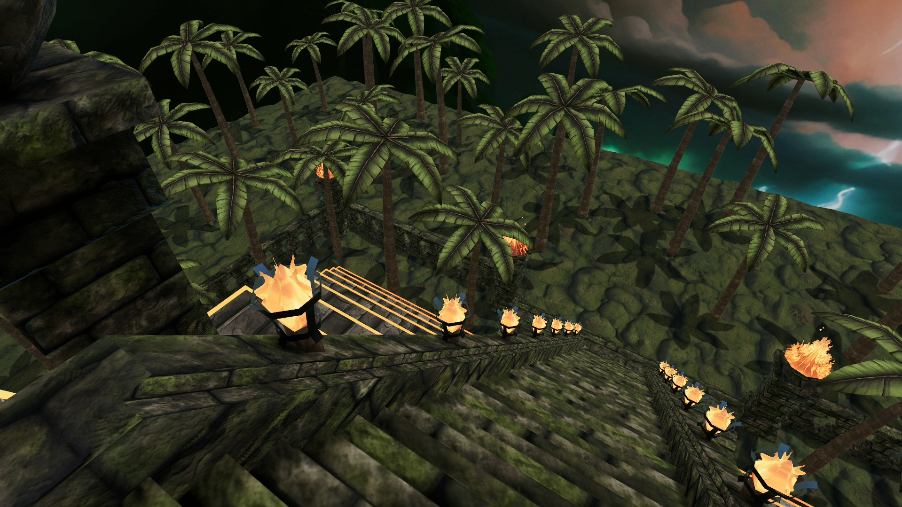
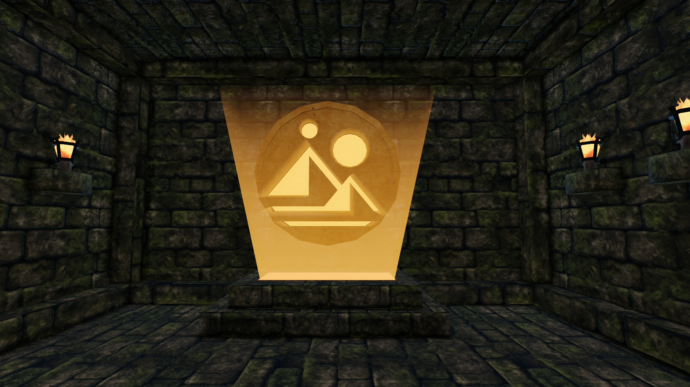
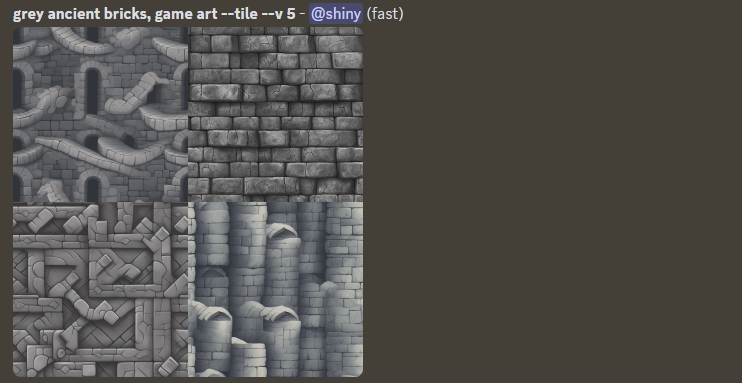
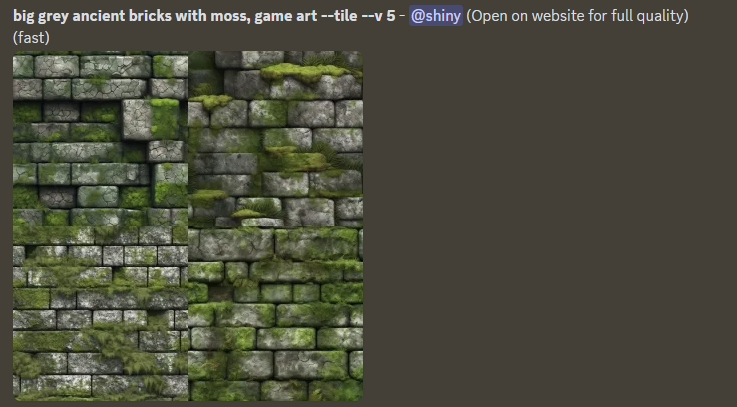
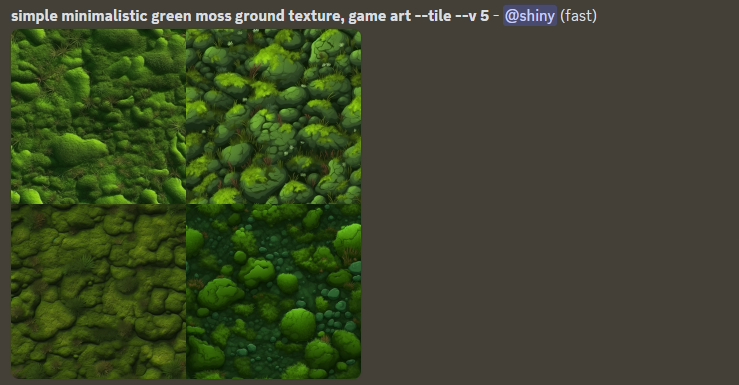
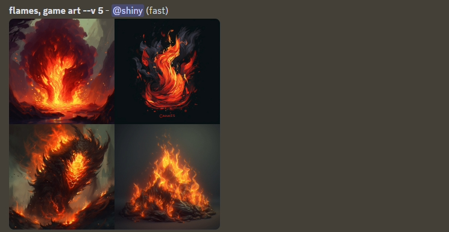

# Decentraland scene

This project contains Decentraland scene created for Sandstorm's Decentraland contest #20 - Hidden Treasures.
Currently deployed under Decentraland name `Positivity`. Follow [this link](https://play.decentraland.org/?realm=positivity.dcl.eth) or type in the Decentraland chatbox `/changerealm positivity.dcl.eth` to visit the scene. This scene is built with the SDK7.

Skybox generated using Blockade Labs [Skybox AI tool](https://skybox.blockadelabs.com/) licensed under the [CC BY 4.0 license](https://creativecommons.org/licenses/by/4.0/)






## 3D models

Textures used for 3D models:

- Bark for palm trees [ambientCG](https://ambientcg.com/view?id=WoodSiding010), AmbientCG has a nice selection of textures under [Creative Commons CC0 1.0 Universal License](https://docs.ambientcg.com/license/)
- Gold for hidden treasure [ambientCG](https://ambientcg.com/view?id=Metal007)
- Textures for bricks, ground, palm tree leafs and fire generated using Midjourney. For some of these images normal maps created using Gimp.
  - Bricks - top right image
    
  - Bricks with moss - bottom right image
    
  - Moss on the ground - bottom left image
    
  - Palm tree leafs - bottom right image
    
  - Fire - bottom right image
    

## Try it out

1. Download this repository.

2. Install the [Decentraland Editor](https://docs.decentraland.org/creator/development-guide/sdk7/editor/)

3. Open a Visual Studio Code window on this scene's root folder. Not on the root folder of the whole repo, but instead on this sub-folder that belongs to the scene.

4. Open the Decentraland Editor tab, and press **Run Scene**

Alternatively, you can use the command line. Inside this scene root directory run:

```
npm run start
```

## Copyright info

This scene is protected with a standard Apache 2 licence. See the terms and conditions in the [LICENSE](/LICENSE) file.
